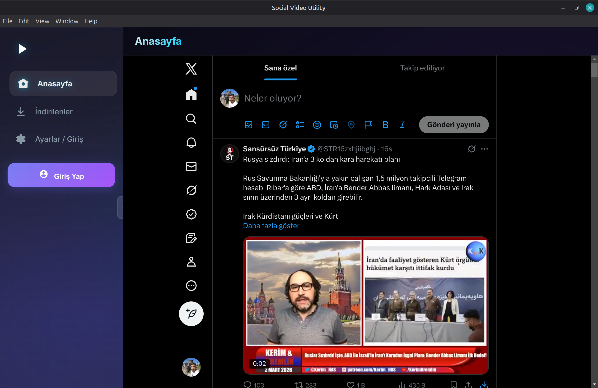
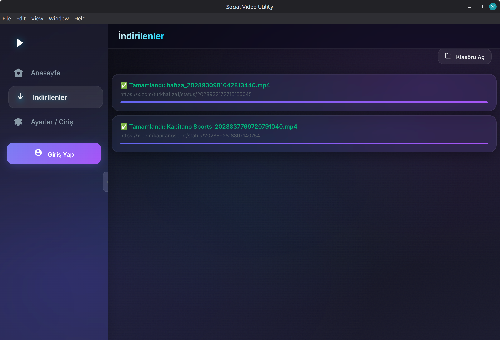
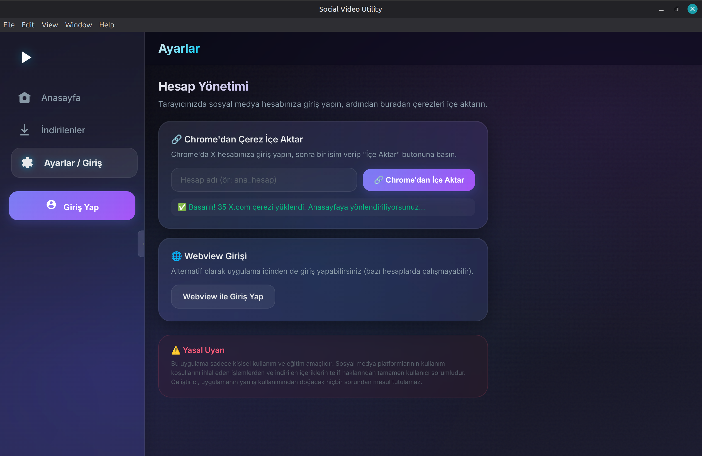

# 🎬 Social Video Utility

[](https://github.com/kaptanoguz/SocialVideoUtility/releases)
[](LICENSE)
[](https://github.com/kaptanoguz/SocialVideoUtility/releases)
[](https://github.com/kaptanoguz/SocialVideoUtility/releases)

A **professional desktop application** for browsing, managing, and downloading social media video content. Built with **Electron** and **Python (yt-dlp)** with a sleek glassmorphism dark-mode UI.

---

## 📸 Screenshots & Demo

<p align="center">
  
  <br><em>🎬 Quick Demo — Browse, Download, Manage</em>
</p>


<p align="center">
  
  <br><em>📺 Main Feed — Browse & download videos with one click</em>
</p>

<p align="center">
  
  <br><em>📥 Downloads — Track all your downloaded videos</em>
</p>

<p align="center">
  
  <br><em>⚙️ Settings — Import cookies, manage accounts</em>
</p>

---

## ✨ Features

| Feature | Description |
|---------|-------------|
| 🌐 **Integrated Browser** | Browse social media feeds directly within the app |
| ⬇️ **One-Click Download** | Download any video with a single click from the tweet action bar |
| 📦 **Bulk Download** | Download all videos from a user's profile page at once |
| 🔍 **Duplicate Detection** | Automatically prevents re-downloading existing videos |
| 🔔 **Toast Notifications** | Non-intrusive notifications — keep browsing while downloading |
| 👥 **Multi-Account** | Switch between multiple accounts with isolated cookie sessions |
| 🎨 **Glassmorphism UI** | Modern dark-mode design with smooth animations |
| 🍪 **Chrome Cookie Import** | Import cookies directly from Chrome browser |

## 🚀 Quick Start

### Linux (Debian/Ubuntu)
```bash
# Download the .deb from releases page
sudo dpkg -i social-video-utility_1.1.0_amd64.deb
sudo apt-get install -f  # Install dependencies if needed
```

### Linux (AppImage — Universal)
```bash
chmod +x Social-Video-Utility-1.1.0.AppImage
./Social-Video-Utility-1.1.0.AppImage
```

### Windows (Portable)
> Coming soon — download and run directly, no installation required.

### From Source
```bash
git clone https://github.com/kaptanoguz/SocialVideoUtility.git
cd SocialVideoUtility
npm install
cd backend && pip install -r requirements.txt && cd ..
npm start
```

## 🛠️ Tech Stack

- **Frontend:** Electron, HTML5, CSS3 (Glassmorphism), Vanilla JavaScript
- **Backend:** Python 3, Flask, yt-dlp
- **Packaging:** electron-builder (.deb, AppImage)
- **Dependencies:** ffmpeg, python3, pip

## 📋 How It Works

1. **Browse** — Navigate social media feeds using the integrated browser
2. **Click** — Hit the download button on any tweet with video content
3. **Download** — Videos are saved to `~/Downloads/SocialVideoUtility/`
4. **Bulk** — Visit a user's profile and click "Tümünü İndir" to grab all videos

## 🔄 What's New in v1.1.0

- 🗑️ Removed right panel for a cleaner, wider UI
- 🔍 Duplicate download detection (3-layer check)
- 📦 Bulk download from user profile pages (scans visible tweets for videos)
- 🔔 Toast notifications — downloads run in background (3-second auto-dismiss)
- 📦 AppImage support for Linux
- 🧹 Cleaned backend (removed unused endpoints)

## ⚠️ Legal Disclaimer

**English:**
This software is provided for educational and personal use only. The developer does not encourage or facilitate any activity that violates the Terms of Service of any social media platform. Users are solely responsible for compliance with platform policies and copyright laws regarding the content they access or download. This tool is provided "as is" without any warranty.

**Türkçe:**
Bu yazılım sadece eğitim ve kişisel kullanım amacıyla geliştirilmiştir. Sosyal medya platformlarının kullanım koşullarını ihlal eden eylemlerden geliştirici sorumlu tutulamaz. İçeriklerin telif hakları ve platform politikalarına uyum konusundaki tüm sorumluluk kullanıcıya aittir. Bu araç "olduğu gibi" sunulmaktadır ve herhangi bir garanti içermez.

## 📄 License

This project is licensed under the MIT License — see the [LICENSE](LICENSE) file for details.

---

<p align="center">
  Made with ❤️ by <a href="https://github.com/kaptanoguz">kaptanoguz</a>
</p>
